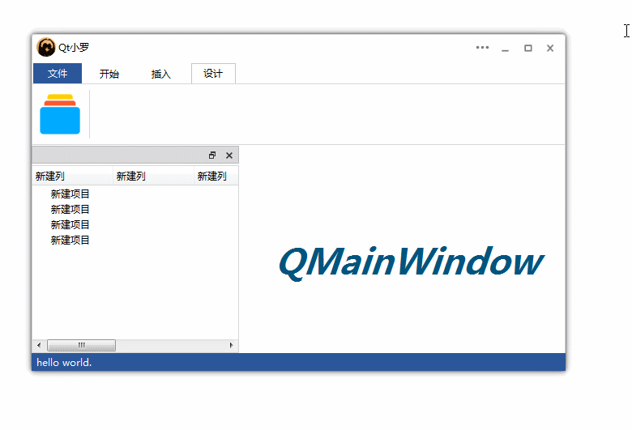
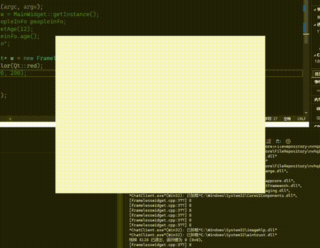

# qt_widget
存放qt 写过的widget

2024/11/10

添加framelessWidget_1/2

1出自[Qt实战6.万能的无边框窗口（FramelessWindow） - Qt小罗 - 博客园](https://www.cnblogs.com/luoxiang/p/13528745.html)

2由[实现qt 窗口无边框拖拽 - haoyouxiaoju - 博客园](https://www.cnblogs.com/hyxj/p/18537865/framelessWidget)

